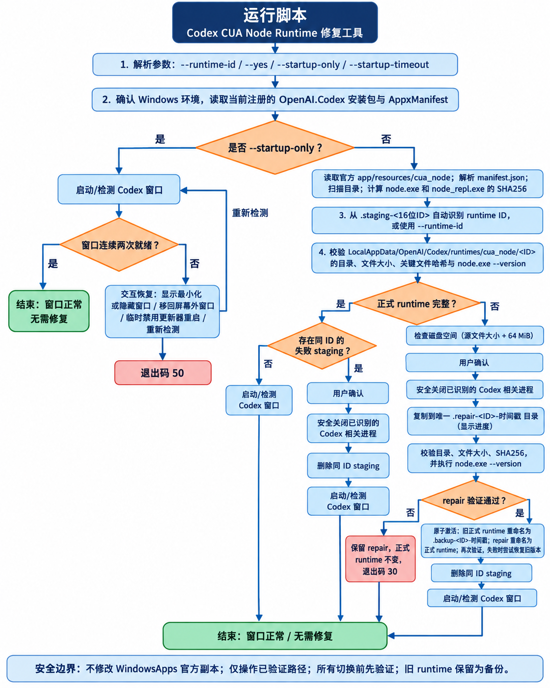

# Codex CUA Node Runtime 修复工具

`codex_runtime_repair.py` 是一个仅适用于 Windows 的 Python 修复脚本。它用于修复 Codex 本地运行时目录中损坏、缺失或未完整落盘的 **CUA Node runtime**，并在修复完成后重新启动 Codex、确认主窗口可用。

脚本以当前已注册的 `OpenAI.Codex` Appx 包中的 `app/resources/cua_node` 作为可信源。它**不会修改** `WindowsApps` 内的官方副本；只有新副本完成文件校验和 Node 可执行性检查后，才会通过重命名将其激活。



## 脚本作用

- 自动定位当前注册的 `OpenAI.Codex` 安装包、版本及 AppUserModelID。
- 读取官方 runtime 的 `manifest.json`，获取 `node.exe`、`node_repl.exe` 和预期 Node 版本。
- 扫描官方 runtime 的目录和文件，计算关键可执行文件的 SHA256。
- 从失败的 `.staging-<16位ID>` 目录中识别 runtime ID；也可由用户显式指定。
- 校验正式 runtime 是否与官方源在目录结构、文件集合、文件大小、关键文件哈希及 `node.exe --version` 上一致。
- 如需修复，先复制到唯一的 `.repair-<ID>-时间戳` 目录，显示复制进度并完成验证；验证成功后再原子激活。
- 将原正式 runtime 保留为 `.backup-<ID>-时间戳`，激活后再次校验；失败时会尝试恢复旧版本。
- 关闭已严格识别的 Codex 相关进程、清理相同 ID 的失败 staging，并重新启动及检测 Codex 窗口。
- 可单独执行启动与窗口健康检测，并针对最小化、隐藏、屏幕外窗口提供交互式恢复选项。

## 运行前注意事项

- **仅支持 Windows。** 需要 Python 3；脚本仅使用标准库，不需要安装第三方依赖。
- 请以可访问当前用户 `LOCALAPPDATA` 和 Appx 包信息的账户运行。脚本通过 PowerShell 的 `Get-AppxPackage` 查询已注册的 `OpenAI.Codex` 包。
- 修复模式会关闭 Codex 进程：先发送正常关闭请求，超时后才终止仍在运行的已识别进程。请先保存任务、对话和其他未保存内容。
- 脚本会创建 `.repair-*` 和 `.backup-*` 目录，并删除**同一 runtime ID** 下可验证的 `.staging-*` 目录。不要在这些目录中存放个人文件。
- 不传 `--runtime-id` 时，必须能在 `%LOCALAPPDATA%\OpenAI\Codex\runtimes\cua_node` 中找到可解析的 `.staging-<16位ID>`；若存在多个不同 ID，脚本会停止以避免误操作。
- `--yes` 只跳过修复前确认；启动失败后的窗口恢复操作仍需在交互式终端中选择。非交互式环境无法进行此类恢复。
- 修复失败时，脚本会尽量保留 repair 副本供排查，并不会把未验证内容替换为正式 runtime。

## 使用说明

在脚本所在目录打开 PowerShell 或命令提示符后运行：

```powershell
python .\codex_runtime_repair.py
```

默认会提示确认。确认前请关闭或保存重要工作。

常用参数：

| 命令 | 说明 |
| --- | --- |
| `python .\codex_runtime_repair.py` | 自动从失败 staging 推断 runtime ID，并交互式确认后修复。 |
| `python .\codex_runtime_repair.py --runtime-id 0123456789abcdef` | 使用指定的 16 位十六进制 runtime ID；适用于存在多个 staging ID 的情形。 |
| `python .\codex_runtime_repair.py --yes` | 跳过修复前确认，适合已确认影响范围的自动化调用。 |
| `python .\codex_runtime_repair.py --startup-only` | 不处理 runtime，仅启动并检测 Codex 窗口；不需要 runtime ID。 |
| `python .\codex_runtime_repair.py --startup-timeout 90` | 将每轮窗口健康检测超时设为 90 秒，最小值为 2 秒，默认 60 秒。 |

建议先使用仅检测模式确认问题是否只是窗口状态：

```powershell
python .\codex_runtime_repair.py --startup-only
```

若检测到窗口最小化、隐藏或位于屏幕外，按菜单选择恢复操作。若窗口未就绪且并非 DWM 隐藏窗口，脚本还可在本次启动中临时设置 `CODEX_SPARKLE_ENABLED=false` 后重启，以绕过特定版本的更新器问题。

## 实现思路

### 1. 发现可信源与目标

脚本调用只读的 `Get-AppxPackage -Name OpenAI.Codex`，选择版本最高的已注册包；随后解析 `AppxManifest.xml` 得到启动所需的 AppUserModelID 和可执行文件路径。官方 runtime 源固定为包内的 `app/resources/cua_node`，目标为：

```text
%LOCALAPPDATA%\OpenAI\Codex\runtimes\cua_node\<runtime-id>
```

`manifest.json` 中的相对路径会先进行安全性检查，拒绝绝对路径、空路径和 `.` / `..` 路径段。

### 2. 完整性验证优先

脚本会对源目录和目标目录建立快照，比较目录集合、文件集合和每个文件的大小；同时验证 `node.exe` 与 `node_repl.exe` 的 SHA256，并执行 `node.exe --version`，检查版本是否符合 manifest。扫描过程中拒绝复制符号链接和目录联接，避免路径逃逸或不确定的复制语义。

### 3. 先验证、后切换

当正式 runtime 无效时，脚本先检查磁盘余量是否不少于源目录大小加 64 MiB，再把文件复制到带时间戳的 `.repair-*` 目录。repair 副本通过完整性和 Node 运行验证后，才执行激活：

1. 若已有正式 runtime，将其重命名为 `.backup-*`。
2. 将 repair 目录重命名为正式 runtime 目录。
3. 再次验证刚激活的 runtime。
4. 若再次验证失败，尽力将新副本移回 repair 目录并恢复 backup。

目录重命名取代逐文件覆盖，因此正式 runtime 不会在复制过程中处于半完成状态。

### 4. 进程与窗口恢复

脚本通过 Windows API 枚举进程，只选择能依据包族名、安装路径、runtime 路径、子进程关系或 `app-server` 命令行特征确认归属的进程。它先投递关闭消息，短暂等待后才按子进程优先顺序终止仍残留的目标。

启动后，脚本每秒采样一次主窗口、renderer 和 app-server 状态。只有同一个有效主窗口连续两次被检测到，才判定启动成功。它会识别 DWM 隐藏、最小化、不可见和屏幕外窗口；仅对仍能重新确认归属的窗口执行恢复或移动。

## 退出码

| 退出码 | 含义 |
| --- | --- |
| `0` | 处理完成，应用窗口启动成功。 |
| `10` | 应用窗口原本已正常，无需操作。 |
| `11` | 用户取消。 |
| `20` | 安装包、manifest 或 runtime ID 发现失败。 |
| `30` | 复制、文件校验或 Node 测试失败。 |
| `40` | 进程关闭、runtime 激活或 staging 清理失败。 |
| `50` | Codex 启动健康检查失败。 |
| `99` | 未预期错误。 |
| `130` | 用户中断。 |

## 生成文件

- `codex_runtime_repair.py`：修复脚本。
- `assets/codex-runtime-repair-flow.png`：基于脚本真实分支生成的完整运行流程图。
